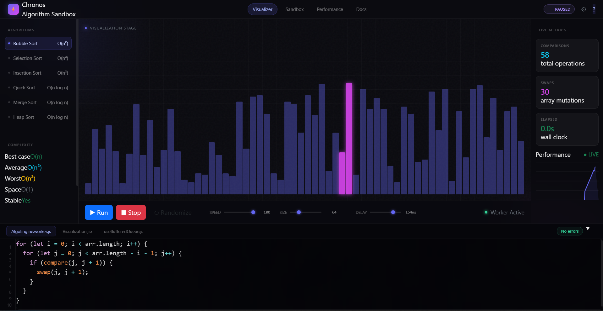

# Chronos: High-Frequency Algorithm Sandbox & Visualizer ⚡

[](https://github.com/Srakeshvarma12/Algorithm-Sandbox-Visualizer)

**Chronos** is a high-performance, Apple-inspired algorithm visualization platform designed for real-time analysis and sandbox experimentation. Built with a focus on buttery-smooth execution and premium aesthetics, Chronos bridges the gap between educational tools and professional development environments.

## 🚀 Key Features

- **Isolated Background Engine**: Computations are handled in a dedicated Multi-threaded Web Worker to ensure zero UI lag during high-frequency operations.
- **Turbo-Charged Rendering**: Utilizes a performance-optimized jQuery-driven DOM rendering strategy for the visualization stage, bypassing React's reconciliation overhead for 60+ FPS animations.
- **Professional Sandbox**: An integrated code suite with syntax highlighting that allows users to write, test, and step-through custom sorting algorithms.
- **Deep Performance Analytics**: Real-time HTML5 Canvas graphing of comparisons and array mutations to analyze algorithmic complexity in action.
- **Premium Apple-Inspired UI**: A sleek, glassmorphism-based design system featuring noise textures, glowing gradients, and liquid interactive elements.

## 🛠️ Technology Stack

- **Framework**: [React](https://reactjs.org/) (State & Layout)
- **State Management**: [Zustand](https://github.com/pmndrs/zustand) (Shared UI State)
- **Visual Engine**: [jQuery](https://jquery.com/) (Direct DOM Mutation)
- **Engine Logic**: [Web Workers](https://developer.mozilla.org/en-US/docs/Web/API/Web_Workers_API) (Isolated Execution)
- **Styling**: Vanilla CSS (Modern Design Tokens & Keyframe Animations)
- **Icons**: Lucide-inspired SVG components

## 🏗️ Architecture

Chronos uses a unique "Isolation & Directness" architecture:
1. **The Worker (Brain)**: Runs the algorithm logic in a separate thread. It emits "snapshots" of the array state via `postMessage`.
2. **The Store (Memory)**: Zustand receives snapshots and manages global playback controls (Speed, Size, Delay).
3. **The Visualizer (Stage)**: A jQuery-powered component that drains a frame-buffered queue via `requestAnimationFrame` to update the DOM bars at the highest possible frequency.

## 📖 API Documentation

The Sandbox exposes a simple yet powerful API to the user's custom code:

- `compare(i, j)`: Compares elements at indices `i` and `j`. Returns `true` if `arr[i] > arr[j]`.
- `swap(i, j)`: Swaps elements at indices `i` and `j` in the local array.
- `await`: Use for asynchronous or recursive implementations (e.g., QuickSort, HeapSort).

## 🚦 Getting Started

### Prerequisites
- [Node.js](https://nodejs.org/) (v16+)
- npm or yarn

### Installation
1. Clone the repository:
   ```bash
   git clone https://github.com/Srakeshvarma12/Algorithm-Sandbox-Visualizer.git
   ```
2. Install dependencies:
   ```bash
   cd Algorithm-Sandbox-Visualizer
   npm install
   ```
3. Run the development server:
   ```bash
   npm run dev
   ```

## 📜 License
Distributed under the MIT License. See `LICENSE` for more information.

